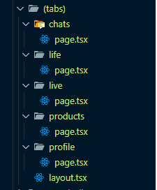

### Bubble Layout



tabs 의 안에 있는 모든 page 의 layout 적용

### image 옵션

> next/image에서 외부 URL 을 불러올 수 있도록 허용

> next.config.js

```TS
images: {
    unoptimized: true,
    remotePatterns: [
        {
            hostname: "avatars.githubusercontent.com",
        },
        {
            hostname: "imagedelivery.net",
        },
    ],
},
```

### Prisma 서버 타입 가져오기

```TS
export type InitialProducts = Prisma.PromiseReturnType<typeof getInitialProducts>;
```

### infinite Scrolling

```TS
const observer = new IntersectionObserver(
    async (entries: IntersectionObserverEntry[], observer: IntersectionObserver) => {
        const element = entries[0];
        if (element.isIntersecting && trigger.current) {
            observer.unobserve(trigger.current);
            setIsLoading(true);
            const newProducts = await getMoreProducts(page + 1);
            if (newProducts.length !== 0) {
                setPage((prev) => prev + 1);
            } else {
                setIsLastPage(true);
            }

            setProducts((prv) => [...prv, ...newProducts]);
            setIsLoading(false);
        }
    }
);

if (trigger.current) {
    observer.observe(trigger.current);
}

return () => {
    observer.disconnect();
};
```

### 로컬 이미지 로드

```TS
const onImageChange = (event: React.ChangeEvent<HTMLInputElement>) => {
    const {
        target: { files },
    } = event;
    if (!files) {
        return;
    }
    const file = files[0];
    const url = URL.createObjectURL(file);
    setPreview(url);
};
```

### Cloudflare Image

> Upload URL 생성은 무료

```TS
const response = await fetch(
    `https://api.cloudflare.com/client/v4/accounts/${process.env.CF_ACCOUNT_ID}/images/v2/direct_upload`,
    {
        method: "POST",
        headers: {
            Authorization: `Bearer ${process.env.CF_API_TOKEN}`,
        },
    }
);
const data = await response.json();
return data;
```

### Intercept React form submission

### cache

```TS
    const getCachedProducts = nextCache(getInitialProducts, ["home-products"]);

    async function getInitialProducts() {
        console.log("hit!!!!");
            const products = await db.product.findMany({
            select: {
            title: true,
            price: true,
            created_at: true,
            photo: true,
            id: true,
            },
            orderBy: {
            created_at: "desc",
            },
        });
   return products;
 }
```

### route Param

```TS
    export const dynamic = "force-dynamic";

    export const revaliate = 60;
```

### generateStaticParams

```TS
    export async function generateStaticParams() {
        const products = await db.product.findMany({
            select: {
                id: true
            }
        });

        return products.map((product) => { id: product.id + "" });
    }
```
